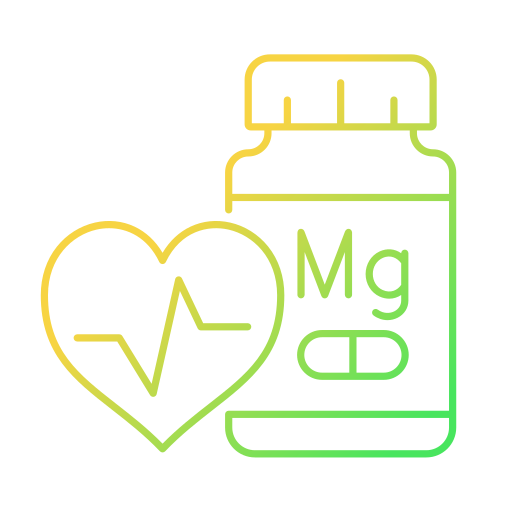

  

<h3 align="center">약나와</h3>

  이미지 기반 건강기능식품 분석 및 합리적인 구매 도움 서비스
   

 
약나와 앱은 사진 촬영 또는 이미지 업로드를 통해 건강기능식품의 상세정보를 조회하고 가격 비교 사이트로 연결해 합리적인 구매를 도와줍니다.
  
<strong>딥러닝</strong> 기술을 활용하여 건강기능식품 이미지에서 <strong>인증마크를 탐지</strong>해 인증 정보를 제공해줍니다.

  
  

## 개발자
**이주훈**
- <https://github.com/CoffeeShelter>
- ij238950@gmail.com